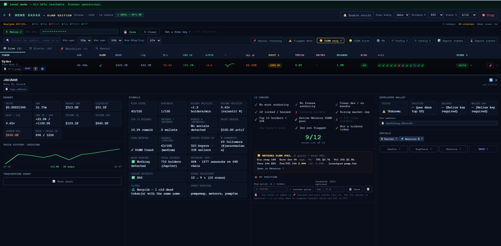

# Meme Radar — DLMM Edition 📡

**Free, open-source Solana memecoin scanner. 12 checks to cut the memecoin jungle down to a shortlist worth a manual look — built with DLMM entries in mind.**

> ⚠️ **This is not a miracle tool.** It is one tool among others. It will not find you the next 100x, it will not remove the risk, and a clean score can still rug. It filters the obvious garbage so you can spend your attention on the few candidates that deserve real due diligence. The decision — and the risk — stay 100% yours. Read the [full disclaimer](DISCLAIMER.md).

## ▶ Try it online

No install, no signup: **[Desktop version](https://dlmmradar.github.io/dlmm-radar/meme_radar.html)** · **[Mobile version](https://dlmmradar.github.io/dlmm-radar/meme_radar_mobile.html)**

Runs entirely in your browser — you'll just need a free [Helius](https://helius.dev) API key (stored locally, never sent anywhere else).

---

## What it does

Hundreds of tokens launch on Solana every day. Checking each one by hand — mint authority, LP lock, holder distribution, dev wallet history — takes minutes per token. This scanner does those checks automatically, continuously, and ranks what survives.

The angle: it was built by a [Meteora DLMM](https://meteora.ag) liquidity provider, for DLMM entries. It can filter for tokens with DLMM pools and favors the profile that matters for LPing (real holders, real volume, liquidity depth) rather than pure momentum chasing.

**One HTML file. No server, no signup, no wallet connection — ever.** It runs entirely in your browser; your API keys are stored locally and never leave your machine.

## The 12 checks

Each token is scored against 12 criteria, including:

- **Mint & freeze authority** revoked
- **LP locked / burned**
- **Bundle detection** (supply grouped at launch)
- **Holder count & growth** (configurable minimum, unique on-chain owners — not the inflated numbers)
- **Top-10 holder concentration**
- **Snipers / insiders share**
- **DLMM pool available** (only / first — toggleable)
- **Dev wallet age & behavior** (fresh wallets are a red flag)
- **Flagged serial deployers** (known rugger wallets, editable list)
- **Tribute-token detection** (tokens riding a KOL's name, editable list)

On top of the score, a **risk index** aggregates penalties, plus:

- 🌀 **Wash-trading heuristic** — unique buyers/sellers per hour vs. volume
- ⛔ **Security cross-check** — transfer fees, hooks, mutable balances (GoPlus vs. RugCheck divergences)
- ♻️ **Recycled ticker detection**
- 🟡 **Meteora DLMM pool metrics** — bin step, base fee, TVL, and the 24h **fee/TVL ratio** straight from Meteora's official API, so you know whether the pool actually pays LPs before you open it
- 🔥 **Virality index (0–100)** — X follower growth, GeckoTerminal trending rank, holder velocity and volume acceleration, combined into one number. Deliberately **kept out of the safety score**: the 12 checks tell you if a token is clean, the flame tells you if it's hot. A viral token can still be a trap.
- 🫧 **One-click Bubblemaps** — direct link to the token's wallet-cluster map, to eyeball connected holders the automated checks can't see
- 📐 **Automatic Fibonacci retracement** — swing low → ATH computed from the pool's own candles, with the 23.6 / 38.2 / 50 / 61.8 / 78.6 levels and where the price sits right now. A market convention, not a prediction.
- 𝕏 **Social signals** — account link, mentions, community size (informational only)
- Organic score & suspicious-audit flag from Jupiter

## Data sources

[DexScreener](https://dexscreener.com) · [RugCheck](https://rugcheck.xyz) · [Helius](https://helius.dev) · [Jupiter](https://jup.ag) · [GeckoTerminal](https://geckoterminal.com) · [GoPlus](https://gopluslabs.io)

All free public endpoints. The only key you need is a **free Helius API key** (used for unique-holder counts and dev wallet history).

### Two ways in

Most scanners start from *new tokens* and check them. This one does that — and the reverse.

The **🔥 hot pools** source queries Meteora for the DLMM pools paying the most **right now** (1h fee/TVL ratio) and feeds those tokens into the scan. That's the LP's angle: start from the pool that's earning, not from the coin that just launched. Toggle it off if you only want fresh launches.

## Getting started

1. **Download** `meme_radar.html` (desktop) or `meme_radar_mobile.html` (phone)
2. **Open it** in Chrome (or any modern browser)
3. **Paste your free Helius API key** in the settings — get one at [helius.dev](https://helius.dev) in two minutes
4. Let it scan. Adjust filters (token age, liquidity floor, DLMM only, minimum holders) to taste.

Interface is available in **English and French** (🌐 toggle next to the config buttons).

### Filters & alerts

Age filters work as a **range** — set a minimum and a maximum to scan a specific window (6–12h, 12–24h…), not just "everything under 24h".

Five optional notification triggers, all off by default except the first:

| Trigger | Fires when |
|---|---|
| 🚀 Takeoff | Virality jumps sharply on a token that passes your score |
| 📈 Trending | Token enters GeckoTerminal's trending list |
| 🟡 DLMM | Pool pays ≥ 5%/day (24h fee/TVL) on a clean token |
| 📐 Fib | Pinned token enters the 50–61.8% retracement zone |
| ⏰ Wake-up | Token older than 6h sees its hourly volume spike |

Anti-spam is built in: one notification per token per category, a 30-minute quiet period per token, and an hourly cap (default 5). Past the cap, triggers are still logged in the Alerts tab — you lose the noise, never the information.

Your settings, flagged-dev list and KOL list persist locally in your browser (localStorage). Export/import them as JSON from the settings panel.

## What it is NOT

- ❌ Not financial advice
- ❌ Not a buy signal
- ❌ Not a guarantee — a clean score can still rug; a flagged token can still pump
- ❌ Not protection against DLMM-specific risks: divergence loss on a volatile token can eat an LP position even when the token doesn't rug

## Support the project

If this saved you from one rug, that's the whole business model 🤝

**SOL donations:** `Em5aKcZ6VvmFnYmAcUDCodkoiBokGGSYabhFRwh9rb3A`

Follow [@DLMMRadar](https://x.com/DLMMRadar) for flagged-token receipts and updates.

## License

[MIT](LICENSE) — do what you want with it, at your own risk.

---

## 🇫🇷 Version française

**Scanner de memecoins Solana, gratuit et open-source. 12 critères pour réduire la jungle à une courte liste méritant un vrai examen — pensé pour les entrées DLMM.**

Ce n'est **pas un outil miracle** : c'est un outil parmi d'autres. Il ne trouvera pas le prochain x100 et n'élimine pas le risque — un bon score peut quand même rugger. Il trie les pièges évidents pour que vous concentriez votre attention sur les rares candidats qui méritent une vraie analyse. La décision, et le risque, restent 100 % les vôtres.

**Un simple fichier HTML.** Pas de serveur, pas d'inscription, jamais de connexion wallet. Tout tourne dans votre navigateur ; vos clés API restent en local.

**Essai en ligne, sans installation :** [version ordinateur](https://dlmmradar.github.io/dlmm-radar/meme_radar.html) · [version mobile](https://dlmmradar.github.io/dlmm-radar/meme_radar_mobile.html)

**Ou en local :** téléchargez `meme_radar.html` (ordinateur) ou `meme_radar_mobile.html` (mobile) et ouvrez-le dans Chrome. Dans les deux cas, collez votre clé Helius gratuite ([helius.dev](https://helius.dev)) dans les réglages. L'interface est disponible en français et en anglais (bouton 🌐 FR/EN).

S'ajoutent un **indice de viralité 0–100** (croissance des abonnés 𝕏, trending GeckoTerminal, vélocité holders, accélération du volume — volontairement séparé du score de sécurité), un **retracement Fibonacci automatique** calculé sur les chandeliers du pool, les **métriques du pool DLMM Meteora** (bin step, base fee, TVL, ratio fees/TVL 24h), des **tranches d'âge** configurables (6–12h, 12–24h…), un lien direct **Bubblemaps** par token et **cinq types de notifications** avec plafond horaire anti-saturation. Une source de découverte **🔥 pools chauds** part des pools DLMM les plus rémunérateurs de la dernière heure plutôt que des tokens fraîchement lancés — l'angle du LP.

Les 12 critères couvrent : autorités mint/freeze révoquées, LP verrouillée, détection de bundles, nombre et croissance des holders réels, concentration du top 10, part des snipers/insiders, présence d'un pool DLMM, âge et comportement du wallet du dev, deployers en série fichés, détection des tokens « tribute ». S'y ajoutent un indice de risque, une heuristique de wash trading, un croisement de sécurité GoPlus/RugCheck, la détection de tickers recyclés et des signaux sociaux 𝕏.

**Dons (SOL) :** `Em5aKcZ6VvmFnYmAcUDCodkoiBokGGSYabhFRwh9rb3A`
